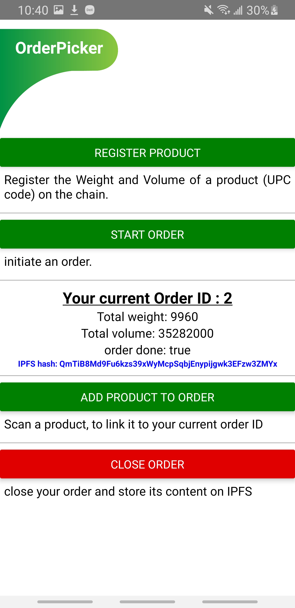
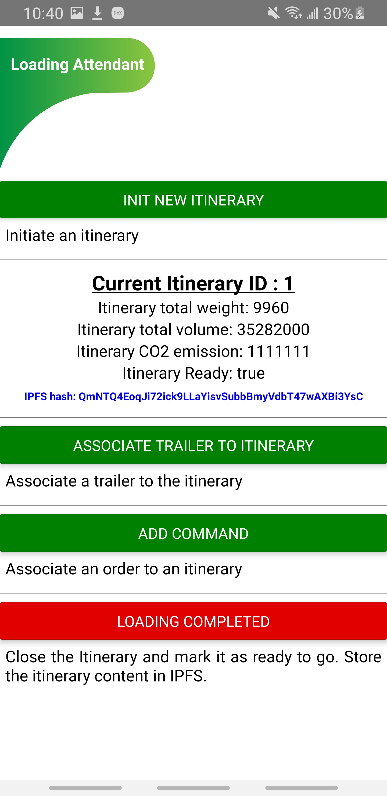
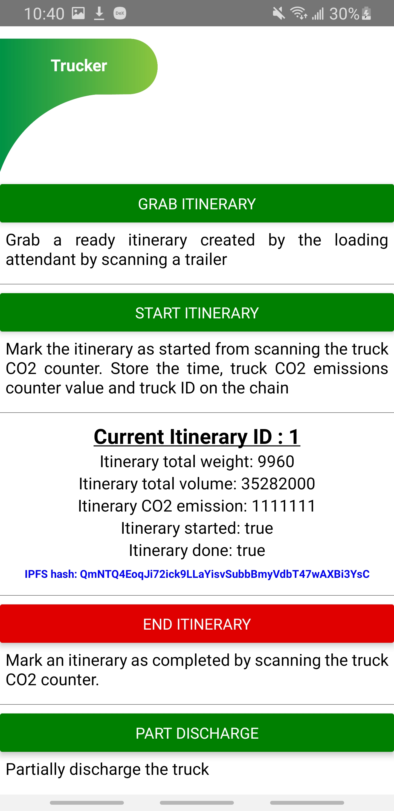
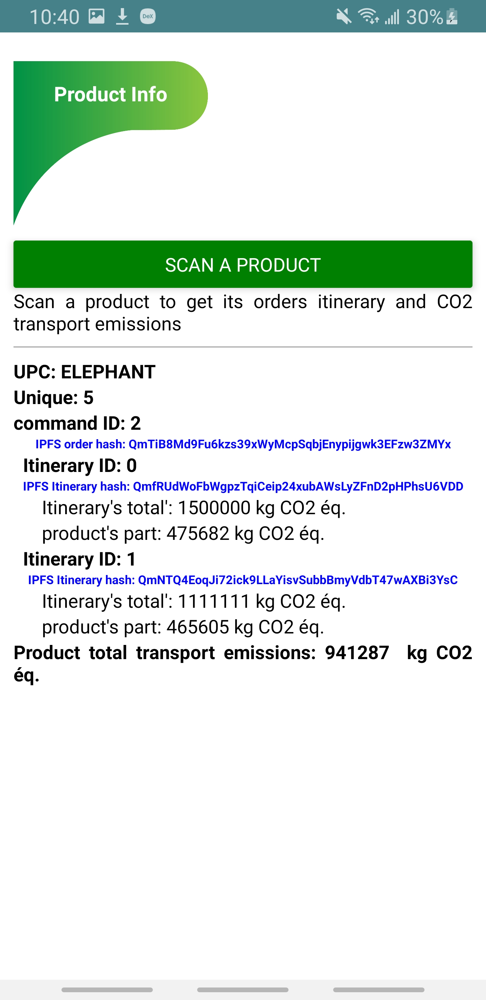

# Contract deployed on Kovan test Network

https://kovan.etherscan.io/address/0x42d252C728739DF6ba95F739ff9C1AD4DF006Df2

# How to set up the app

1) clone the repo
2) in a command line located in root/frontend, enter npm install
3) in root/frontend/ABI_and_keys.js enter your Kovan mnemonic, private, and public keys
4) connect your phone to your computer
5) in a command line located in root/frontend, enter react-native start
6) in another command line located in root/frontend, enter react-native run-android

Now you should be able to participated in the contract, you can use QR codes located in root/QrCodes or make your own products

See demo of how to use the app:
https://www.youtube.com/watch?v=TZ-BCY8ahPA&t=240s

# CO2_Merchandise_Transportation_Tracker

Proof of concept of DAPP on Ethereum that track carbon footprint of merchandise transportation.
The goal is to internalize itineraries emissions on products.

# Structure of the system:

# Contract Structure:

# Application pages
## Home

## Order Picker APP

## Loading Attendant APP

## Trucker APP

## Product Info APP

