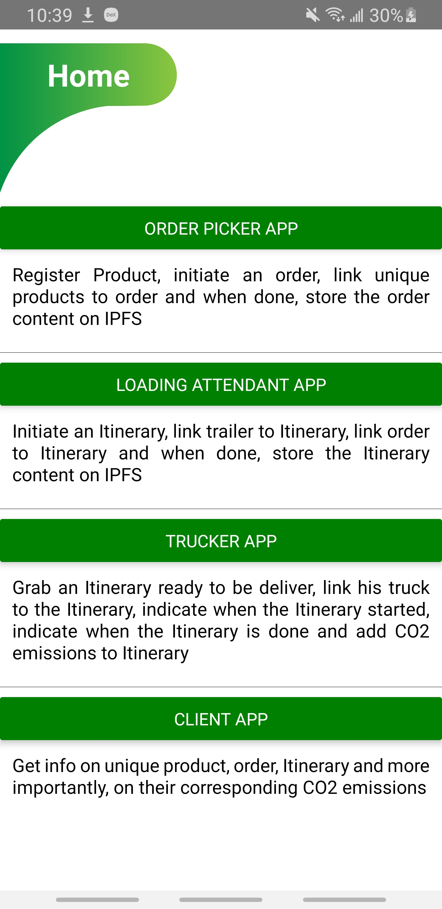

# CO2_Merchandise_Transportation_Tracker

Proof of concept of DAPP on Ethereum that track carbon footprint of merchandise transportation.
The goal is to internalize itineraries emissions on products.

## Structure of the system:

# Application pages

## Home
 <! .element height="50%" width="50%" >

## Order Picker APP

## Loading Attendant APP

## Trucker APP

## Product Info APP

